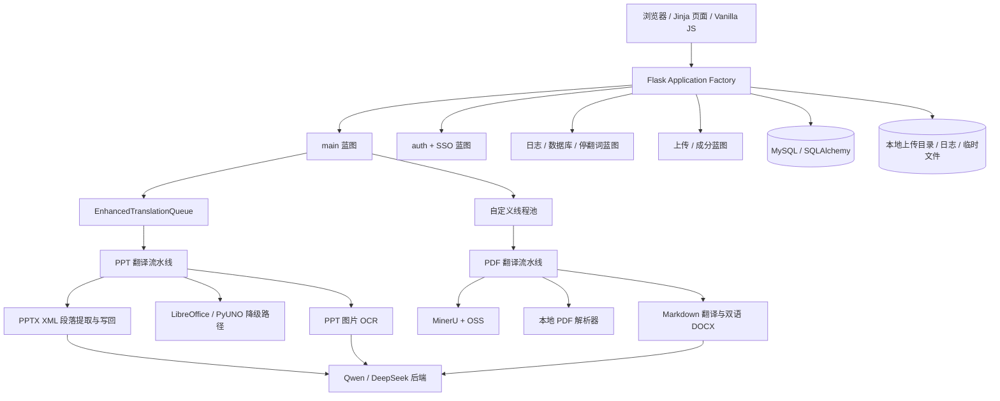

# FCIAI 2.0 项目架构、需求与功能全景

> 盘点日期：2026-07-17
> 盘点范围：当前工作区中的应用代码、模板、静态资源、测试、配置、启动脚本、迁移脚本和已有说明文档。
> 说明：本文件描述“当前代码实际表达的需求与完成度”，不是最初产品需求书。工作区存在未提交改动，因此结论对应本次盘点时的代码状态。
> 翻译子系统的当前运行设计、上线值和回滚方式以 `docs/TRANSLATION_ARCHITECTURE.md` 为准。

## 1. 完成度判定标准

| 状态 | 含义 |
| --- | --- |
| 已实现 | 有可达入口，前后端或调用链闭环，核心行为有代码证据；关键能力最好还有测试或实际产物证据。 |
| 有条件可用 | 实现基本完整，但依赖外部服务、密钥、数据库、LibreOffice 或特定部署条件。 |
| 部分实现 | 已有主要代码或界面，但存在缺口、失效分支、前后端不一致、未验证路径或不能稳定交付。 |
| 未实现 | 明确为 TODO、`pass`、`NotImplementedError`、占位返回，或路由指向不存在的模板。 |
| 孤立/旧实现 | 代码仍在仓库，但未被主应用注册、已被新实现替代，或只存在于备用入口。 |

## 2. 项目定位与总体结论

FCIAI 2.0 是一个以 Flask 为主的内部文件翻译与管理系统，核心场景是：

1. 上传 PPT/PPTX，按页面和段落翻译，保留或追加原文，并维护文本框格式。
2. 上传 PDF，经 MinerU/本地解析转为 Markdown，再生成双语 DOCX。
3. 管理个人/公共翻译词库和停翻词，并将词库注入翻译任务。
4. 搜索和维护食品成分资料及附件。
5. 提供用户、审批、SSO、文件、日志、数据库连接池和系统运行状态管理。

当前仓库已经形成可用的 PPT XML 翻译主链路、PDF 到双语 DOCX 链路，以及词库、成分搜索、用户审批和日志管理等业务闭环。翻译运行时已拆分 Web/Worker 角色，并新增持久化任务账本、Provider Adapter、结构质量检查、幂等产物和确定性版式验收；但整个产品仍不是全部需求完成态。主要剩余缺口包括：

- 项目仍保留多套历史配置和兼容入口；运行职责已统一，但旧配置值尚未全部删除。
- PDF 翻译依赖较多，Qwen/DeepSeek 选择已完整传入翻译器，最终产物按当前产品契约仍是 DOCX 而非翻译后的 PDF。
- SAML、训练接口、若干页面、旧成分接口和 PDF 写回逻辑未完成。
- 简版监控蓝图没有注册；部分管理员功能有权限或事务错误。
- V2 任务状态已持久化并支持中断投影/恢复；旧内存路径仍作为 `legacy` 回滚分支保留。
- 翻译核心已有单元、路由契约、故障、性能和真实 LibreOffice 产物测试；认证、完整 UI 浏览器和真实外部服务联调仍有缺口。

## 3. 总体架构



### 3.1 表现层

- 服务端页面：Jinja2 模板，位于 `app/templates/`。
- 前端逻辑：原生 JavaScript 为主，位于 `app/static/js/`，部分页面使用 CDN 版 Vue、Element UI、Axios、ECharts、Font Awesome。
- 没有完整前端构建链；`app/components/LogManagement.vue` 是孤立 Vue 源文件，主日志页面实际使用模板内脚本。
- 主导航和角色入口由 `app/templates/main/base_layout.html` 控制。

### 3.2 Web 与路由层

开发主入口是 `run.py -> app.create_app('development')`，生产拆分为 Web 与 Worker。应用工厂在 `app/__init__.py` 中注册 9 个蓝图：

| 蓝图 | 路径前缀 | 主要职责 | 路由数 |
| --- | --- | --- | ---: |
| `main` | 无 | PPT/PDF、词库、用户管理、历史、系统管理和大部分页面 | 73 |
| `auth` | `/auth` | 注册、登录、退出、改密、当前用户信息 | 5 |
| `sso` | `/auth/sso` | OAuth/Authing/SAML 登录与配置 | 9 |
| `upload` | `/api` | 通用文件上传、列表、删除、配额 | 4 |
| `ingredient` | `/ingredient` | 成分搜索、文件上传、列表和下载 | 6 |
| `stop_words` | 无 | 用户停翻词 CRUD/统计 | 4 |
| `log_management` | 无 | 日志查询和日志级别管理 | 4 |
| `db_management` | 无 | 数据库连接池页面和回收 | 2 |
| `translation_health` | 无 | 鉴权的翻译任务健康汇总 | 1 |

当前测试配置的主应用共生成 110 条 URL rule（含框架静态路由）。`app/routes/monitor.py` 另有 2 个路由，但没有在 `create_app()` 中注册，因此不可达。

### 3.3 服务与任务层

- `app/utils/enhanced_task_queue.py`：PPT 翻译任务队列、优先级、并发、重试、取消、日志和状态。
- `app/jobs/`：V2 任务账本 Adapter、执行器、Worker、状态投影、不可变产物和恢复。
- `app/translation/`：Provider、Translation Unit、质量、记忆、批处理、指标和 LibreOffice 隔离。
- `app/utils/thread_pool_executor.py`：PDF 等 IO/CPU 任务线程池。
- `app/services/translation_jobs.py`：上传限制、词表 ID 解析、语言字段映射和自定义词典构建。
- `app/services/sso_service.py`、`authing_provider.py`、`user_service.py`：SSO 与用户同步。
- `app/utils/storage_manager.py`、`app/services/oss_service.py`：本地文件与 OSS 支撑能力。
- `app/tasks/cleanup.py`、`cleanup_task.py`：定期清理上传和临时文件。

V2 任务系统以 MySQL `translation_jobs` 为状态事实源，Worker 通过租约和版本号领取任务，原有页面/API 状态由统一投影器生成。PPT 队列、`simple_task_status`、`pdf_task_status_cache` 仍作为 `legacy` 回滚路径保留；只有 legacy 模式继续承担其原有的进程内限制。

### 3.4 数据与持久化

| 模型 | 主要字段 | 用途 | 现状 |
| --- | --- | --- | --- |
| `User` | 用户名、密码、邮箱、姓名、SSO 信息、角色、审批状态、审批人、登录时间 | 身份、登录、审批和权限 | 已实现；状态实际包含 `pending/approved/rejected/disabled`。 |
| `Role` / `Permission` | 角色名、权限名、多对多关系 | RBAC | 模型已实现，但多数路由直接判断管理员角色，细粒度 Permission 使用较少。 |
| `Translation` | 英/中/荷文本、分类、所有者、是否公共 | 私有/公共词库 | 已实现。 |
| `StopWord` | 词、用户、创建时间 | 用户停翻词 | 已实现。 |
| `UploadRecord` | 原文件名、存储名、目录、大小、时间、状态、错误 | PPT/PDF/通用文件历史 | 已实现，但没有 `file_type`，历史分类依赖扩展名和路径猜测。 |
| `TranslationJob` | 公共 ID、用户、类型、状态、阶段、请求、租约、版本、attempt、源/产物哈希 | V2 持久任务与恢复 | 已实现；迁移只新增表和索引，不修改旧表。 |
| `Ingredient` | 食品名、原料、路径、时间 | 成分数据 | 模型存在；当前成分搜索主要直接读取 JSON 文件，未形成统一数据库链路。 |

数据库默认采用 MySQL + PyMySQL。测试配置声明 SQLite 内存库，但 `Config.init_app()` 会再次按 MySQL 形式组装 URI，配置层存在冲突风险。

## 4. 角色与权限需求

| 角色 | 当前可见/可用能力 | 完成度 |
| --- | --- | --- |
| 未登录用户 | 登录、注册、SSO 状态；另有 4 个无认证 PPT 翻译接口 | 部分实现；公开 PPT API 可被匿名消耗计算资源。 |
| 普通用户 | PPT/PDF 翻译、词库、停翻词、成分搜索、个人历史、通用上传、改密 | 已实现或有条件可用。 |
| SSO 用户 | SSO 登录、资料同步、退出；不能修改本地密码 | OAuth/Authing 有条件可用；SAML 未实现；SSO 退出存在控制流错误。 |
| 管理员 | 注册审批、用户启停、公共词库、成分文件、全局文件、日志、数据库、系统状态、SSO 配置 | 多数已实现；存在菜单错链、系统监控权限判断错误和管理员删除事务错误。 |

## 5. 功能需求与完成度矩阵

### 5.1 PPT 翻译

| 需求/功能 | 状态 | 当前实现与限制 |
| --- | --- | --- |
| PPT/PPTX 上传 | 已实现 | `/upload` 校验扩展名、大小、用户目录并建立 `UploadRecord`。完整主应用和 README 当前说明 12GiB；根兼容配置与部分前端提示仍需统一。 |
| 选择指定页面或全部页面 | 已实现 | 选页参数进入 XML 提取和翻译请求；未选页面保持原 XML。 |
| 英/中/荷语言选择 | 已实现 | 首页提供语言选择，并将名称映射为语言代码。 |
| 按页批量调用翻译模型 | 已实现 | `api_translate_uno.translate_pages_by_page()` 将同页段落组成一次请求。 |
| Qwen 模型 | 有条件可用 | 当前 XML 主链路使用 DashScope OpenAI 兼容接口，需要 `QWEN_API_KEY`。 |
| DeepSeek 模型 | 有条件可用 | 已通过显式 Provider Adapter 接入 XML 主链路；仍依赖固定远端 agent_server 的可用性。失败不会静默切换到 Qwen。 |
| GPT-4o 模型 | 未交付 | XML API 有 `gpt4o` 后端分支，但首页选项已注释；旧异步分支为 TODO，且 `gpt-4o/gpt4o` 命名不一致。 |
| 私有/公共词库注入 | 已实现 | 按当前用户与公共可见性筛选词条，按源/目标语言构建映射。 |
| 临时自定义翻译 | 已实现 | 支持表单内 `原文 -> 译文` 映射并与词库合并。 |
| 停翻词 | 已实现 | 支持任务临时停翻词和持久化个人停翻词。 |
| `translation_only` | 已实现 | 仅保留译文，替换原文本节点。 |
| `paragraph_up` | 已实现 | 保留原文，在同一段落换行后追加译文。 |
| `paragraph_down` | 已实现 | 先写译文，再换行追加原文。 |
| 保留文本片段格式 | 已实现但有限制 | 翻译返回的 `[block]` 片段数匹配时克隆原 run 样式；数量不匹配时会合并为单一片段。 |
| 文本框自动适配 | 已实现并有测试 | 写入译文时移除 `noAutofit/spAutoFit`，写入 `a:normAutofit`，由 Office/LibreOffice 按框缩小文字。 |
| XML 优先、布局保真 | 已实现 | 直接复制 PPTX ZIP 并只替换目标 slide XML；成功后立即返回，不再进入旧布局调整。 |
| LibreOffice/PyUNO 降级 | 有条件可用 | XML 路径失败时使用 PPTX/ODP/UNO 流程，需要本机 LibreOffice。 |
| `.ppt` 兼容 | 部分实现 | XML 路径只支持 `.pptx`；`.ppt` 依赖 UNO/转换路径，未有自动化验证。 |
| PPT 图片 OCR 与翻译 | 部分实现 | 可提取图片、调用 Qwen OCR/翻译并向幻灯片追加文本；依赖密钥，缺端到端测试。 |
| 队列、进度、重试、取消 | 已实现 | V2 使用数据库任务账本、租约、版本校验和统一状态投影；旧 `EnhancedTranslationQueue` 作为 `legacy` 回滚路径保留。自动恢复默认关闭。 |
| 翻译历史、下载、删除 | 已实现 | 用户可查看个人 PPT 历史并下载/删除。 |
| 无认证兼容 API | 已实现但风险高 | `/start_translation`、`/task_status/<task_id>`、`/download/<task_id>`、`/ppt_translate` 不要求登录。 |

PPT 当前主流程：

```text
首页上传
  -> 保存 UploadRecord
  -> EnhancedTranslationQueue
  -> process_presentation()
  -> pyuno_controller()
  -> XML 提取可翻译段落
  -> 按页调用 Qwen/DeepSeek
  -> 解析 JSON 和片段
  -> 按显示模式写回 slide XML + normAutofit
  -> 覆盖原任务文件
  -> 更新任务和历史状态
```

核心证据：`app/views/main.py:425`、`app/utils/enhanced_task_queue.py:960`、`app/function/ppt_translate_async.py:587`、`app/function/pynuo_fuc/pyuno_controller.py:601`、`app/function/pynuo_fuc/pptx_xml_translate.py:27`、`app/function/pynuo_fuc/pptx_xml_ops.py:197`。

### 5.2 PDF 翻译与注释

| 需求/功能 | 状态 | 当前实现与限制 |
| --- | --- | --- |
| PDF 上传与异步启动 | 已实现 | V2 页面请求写入统一任务账本并由 Worker 执行；旧 session + 内存状态路径仅在 `legacy` 模式保留。 |
| MinerU + OSS 解析 | 有条件可用 | 需要 `MINERU_API_KEY`、OSS 凭据和网络；首选 OSS 直链。 |
| 本地 PDF 解析降级 | 部分实现 | OSS/MinerU 失败后调用本地处理器，但本地结果仍必须满足类似 MinerU 的 ZIP/Markdown 协议。 |
| PDF 文本翻译 | 已实现但输出受限 | Markdown 被翻译并生成双语 DOCX；PDF 原位写回仍不在当前实现范围。 |
| 英/中/日语言选择 | 已实现 | UI 和文档生成器支持 EN/ZH/JA 映射。 |
| Qwen 模型 | 有条件可用 | 通过 Provider Adapter 调用 Qwen，需要模型密钥和网络。 |
| DeepSeek 模型 | 有条件可用 | UI 的 `model` 已沿任务、解析/OCR 和文档生成全链路传递；失败不会调用 Qwen。 |
| 图片 OCR | 部分实现 | 可识别 Markdown 引用图片并把 OCR 原文/译文加入 DOCX；依赖 Qwen OCR。 |
| 词库注入 | 已实现 | 从选中词条构建自定义词典并传入文档生成器。 |
| 进度/历史/下载/删除 | 已实现 | V2 状态持久化，最终产物原子发布，重复投递只登记一次历史；旧模式仍保持原响应字段。 |
| PDF 原位翻译写回 | 未实现 | `pdf_translation_utils.py` 明确保留写回框架/TODO；当前产物是 DOCX。 |
| PDF 注释页面 | 未实现 | API 能保存/读取注释 JSON，但 `/pdf_annotate` 引用的 `main/pdf_annotate.html` 不存在。 |

PDF 当前主流程：

```text
PDF 页面上传
  -> 保存 pdf_uploads
  -> 自定义线程池
  -> OSS + MinerU，失败则本地解析
  -> 下载/解压结果 ZIP
  -> 寻找 Markdown
  -> 可选图片 OCR
  -> Qwen 翻译 Markdown
  -> 生成双语 DOCX
  -> 保存 UploadRecord
  -> 内存缓存返回完成状态
```

核心证据：`app/views/main.py:61`、`app/views/main.py:2400`、`app/views/main.py:2466`、`app/views/main.py:3027`、`app/utils/document_generator.py:656`。

### 5.3 翻译词库与停翻词

| 需求/功能 | 状态 | 当前实现与限制 |
| --- | --- | --- |
| 私有词库列表、搜索、分页 | 已实现 | 普通用户查看自己的私有词条。 |
| 公共词库 | 已实现 | 所有人可读；仅管理员可新增/修改/删除公共词条。 |
| 英/中/荷三语词条 | 已实现 | 模型和 CRUD API 均支持。 |
| 分类与分类筛选 | 已实现 | 分类字段允许组合值，提供分类 API。 |
| 统计 | 已实现 | 提供词条和停翻词统计。 |
| Excel 批量上传 | 部分实现 | 上传、解析和批量插入存在；`.xls` 声称支持，但主要实现依赖 openpyxl，实际兼容性需验证。 |
| Excel 模板下载 | 未实现 | 页面请求 `/api/translations/download_template`，但没有对应路由；模板生成代码误置在不可达分支。 |
| 模型训练 | 未实现 | `/api/train` 只统计数据库词条并返回“训练完成”，真实训练代码被注释。 |
| 个人停翻词 CRUD | 已实现 | 登录用户可查询、添加、删除和查看统计。 |

### 5.4 成分搜索与文件

| 需求/功能 | 状态 | 当前实现与限制 |
| --- | --- | --- |
| 注册/备案成分数据搜索 | 已实现 | 新接口按关键词、数据源、分页搜索 JSON 数据。 |
| 图片/原始文件访问 | 已实现 | 支持安全路径解析、单文件下载和目录打包 ZIP。 |
| 管理员上传成分文件 | 已实现 | 支持流式上传、进度、列表、下载和缓存刷新。 |
| 旧 `/search` | 未实现 | 固定返回空数组。 |
| 旧 `/ingredient/download` | 未实现 | 固定返回“功能暂未实现”并使用 500。 |
| `Ingredient` 数据库模型 | 孤立/部分 | 模型存在，但当前搜索主要读取文件数据，没有统一入库流程。 |

实际可用前端调用 `/ingredient/api/ingredient/*`，不依赖上述两个旧占位接口。

### 5.5 认证、SSO 与用户管理

| 需求/功能 | 状态 | 当前实现与限制 |
| --- | --- | --- |
| 本地注册 | 已实现 | 校验用户名/密码并创建 `pending` 用户。 |
| 本地账号密码登录 | 后端已实现、UI 隐藏 | `/auth/login` 可处理 POST，但登录模板已注释本地表单；SSO 未启用时页面只提示联系管理员。 |
| 注册审批 | 已实现 | 管理员查看、批准和拒绝注册。 |
| 用户启用/禁用 | 已实现 | 管理员可切换 `approved/disabled`。 |
| 用户信息与改密 | 已实现 | 普通本地用户可改密；SSO 用户禁止改密。 |
| OAuth2/Authing SSO | 有条件可用 | 需要完整 client、secret、授权、token、userinfo 和回调配置。 |
| 自动创建/同步 SSO 用户 | 已实现 | 可映射用户名、邮箱、姓名、组信息并登录。 |
| SAML 登录/ACS | 未实现 | 页面与服务均明确为开发中，服务回调抛 `NotImplementedError`。 |
| SSO 登出 | 部分实现 | `finally` 中返回本地登录页会覆盖此前的 IdP 登出重定向。 |
| SSO 开发测试 | 部分实现 | 有测试页面和模拟用户，但环境判断依赖 `ENV`，主配置未稳定设置该键。 |
| SSO 管理页面 | 未实现 | 原 `/sso_management` 路由与模板引用均被注释，仅保留管理员配置 JSON API。 |

### 5.6 文件、历史与存储

| 需求/功能 | 状态 | 当前实现与限制 |
| --- | --- | --- |
| 通用文件上传 | 已实现 | `/api/upload` 按 `ppt/pdf/annotation/temp` 存储并创建记录。 |
| 个人文件列表和配额 | 已实现 | 支持分页、状态过滤和存储占用统计。 |
| 个人文件删除 | 部分实现 | 从 `record.file_path` 用 `/` 推导类型，在 Windows 反斜杠路径上可能失效。 |
| PPT/PDF 分类历史 | 部分实现 | `UploadRecord` 无文件类型字段，依赖扩展名和路径判断。 |
| 管理员文件列表、筛选、下载 | 已实现 | 页面和 API 存在。 |
| 管理员删除文件 | 部分实现 | 物理文件会删除，但 `db.session.commit()` 位于异常返回之后，正常路径不会提交数据库删除。 |
| 定时清理 | 有条件可用 | 只由 Worker 运行角色启动；生产保持一个 Worker 时不会随 Web worker 重复。保留策略由环境变量控制。 |

### 5.7 日志、数据库与系统监控

| 需求/功能 | 状态 | 当前实现与限制 |
| --- | --- | --- |
| 日志列表、查询、级别调整 | 已实现 | 管理员页面和 4 个 API 已注册。 |
| 数据库连接池状态 | 已实现 | 提供池配置、签出连接、线程池和队列状态。 |
| 手动回收数据库连接 | 已实现 | 主页面与独立数据库蓝图各有接口。 |
| 系统 CPU/内存/线程池/队列状态 | 部分实现 | 页面与 API 存在；页面权限判断写成 `current_user.is_administrator` 而非调用方法，普通登录用户也能加载页面。管理 API 仍有管理员校验。 |
| 重置线程池/任务队列 | 已实现但高风险 | 管理员可执行；对正在运行任务的影响没有事务性保护。 |
| 简版 CPU/内存/GPU 趋势监控 | 孤立/不可达 | `monitor` 蓝图代码和模板完整，但应用工厂未注册蓝图；旧 `main/dashboard.html` 还链接到不存在的 `main.monitor` endpoint。 |

### 5.8 国际化与界面

| 需求/功能 | 状态 | 当前实现与限制 |
| --- | --- | --- |
| 中英文切换 | 部分实现 | session 保存 `zh/en`，主要模板使用条件表达式；不是统一 i18n 资源系统，覆盖不完整。 |
| 管理员导航 | 部分实现 | `User Management` 菜单错误指向注册审批页面；系统监控和数据库菜单被注释。 |
| 首页文件限制提示 | 不一致 | README 与完整主应用说明 12GiB，前端仍显示 50MB，根兼容配置仍保留旧值。 |
| 页面资源离线可用 | 部分实现 | 多个管理页面依赖 CDN；内网离线环境会缺图标、图表或 JS 库。 |

## 6. 已声明但缺模板的页面

以下 GET 路由会尝试渲染不存在的模板，访问时会产生 `TemplateNotFound` 或自定义 500：

| 路由 | 缺失模板 | 状态 |
| --- | --- | --- |
| `/page1` | `main/page1.html` | 未实现 |
| `/page2` | `main/page2.html` | 未实现 |
| `/translate` | `main/translate.html` | 未实现 |
| `/batch_process` | `main/batch_process.html` | 未实现 |
| `/settings` | `main/settings.html` | 未实现 |
| `/pdf_translation` | `main/pdf_translation.html` | 未实现；可用入口是 `/pdf_translate`。 |
| `/file_search` | `main/file_search.html` | 未实现 |
| `/account_settings` | `main/account_settings.html` | 未实现 |
| `/pdf_annotate` | `main/pdf_annotate.html` | 未实现 |

## 7. 完整路由能力清单

### 7.1 主蓝图：页面与 PPT

| 方法与路径 | 能力 | 状态 |
| --- | --- | --- |
| `GET /`、`GET /index` | PPT 翻译首页 | 已实现 |
| `GET /dashboard` | 重定向首页 | 已实现 |
| `GET /page1`、`GET /page2` | 预留页面 | 未实现，缺模板 |
| `POST /upload` | 登录用户上传 PPT 并加入队列 | 已实现 |
| `GET /task_status` | 当前用户 PPT 任务状态 | 已实现 |
| `GET /queue_status` | 队列汇总 | 已实现 |
| `GET /history` | 旧 PPT 历史 | 已实现但与新历史 API 重复 |
| `GET /download/<int:record_id>` | 按记录下载 | 已实现 |
| `DELETE /delete/<int:record_id>` | 按记录删除 | 已实现 |
| `GET /api/ppt_translation_history` | PPT 历史 | 已实现 |
| `GET /get_queue_status` | 旧详细队列 API | 孤立/兼容 |
| `GET /cancel_task/<task_id>` | 取消任务 | 已实现；使用 GET 改变状态不规范 |
| `POST /start_translation` | 匿名异步 PPT 翻译 | 已实现但有资源滥用风险 |
| `GET /task_status/<task_id>` | 匿名任务状态 | 已实现 |
| `GET /download/<task_id>` | 匿名任务下载 | 已实现 |
| `POST /ppt_translate` | 匿名同步 PPT 翻译 | 已实现但会长时间占用请求 |

### 7.2 主蓝图：业务页面

| 方法与路径 | 能力 | 状态 |
| --- | --- | --- |
| `GET /translate` | 旧翻译页面 | 未实现，缺模板 |
| `GET /pdf_translate` | PDF 翻译页面 | 已实现 |
| `GET /batch_process` | 批处理页面 | 未实现，缺模板 |
| `GET /settings` | 设置页面 | 未实现，缺模板 |
| `GET /pdf_translation` | 旧 PDF 翻译页面 | 未实现，缺模板 |
| `GET /dictionary` | 词库页面 | 已实现 |
| `GET /file_search` | 文件搜索页面 | 未实现，缺模板 |
| `GET /account_settings` | 账号设置页面 | 未实现，缺模板 |
| `GET /registration_approval` | 注册审批 | 已实现，管理员 |
| `GET /ingredient` | 成分搜索 | 已实现 |
| `GET /ingredient/upload` | 成分文件管理 | 已实现，管理员 |
| `GET /logs` | 日志管理 | 已实现，管理员 |
| `GET /db_stats` | 数据库状态 | 已实现，管理员 |
| `GET /system_monitoring` | 系统监控 | 部分实现，页面权限校验错误 |
| `GET /pdf_annotate` | PDF 注释页面 | 未实现，缺模板 |
| `GET /file_management` | 全局文件管理 | 部分实现，管理员删除事务有缺口 |
| `GET /user_management` | 用户启停管理 | 已实现，但导航错链 |

### 7.3 主蓝图：用户与词库 API

| 方法与路径 | 能力 | 状态 |
| --- | --- | --- |
| `GET /api/registrations` | 注册列表 | 已实现，管理员 |
| `POST /api/registrations/<int:id>/approve` | 批准注册 | 已实现，管理员 |
| `POST /api/registrations/<int:id>/reject` | 拒绝注册 | 已实现，管理员 |
| `GET /api/users` | 用户列表 | 已实现，管理员 |
| `POST /api/users/<int:id>/disable` | 禁用用户 | 已实现，管理员 |
| `POST /api/users/<int:id>/enable` | 启用用户 | 已实现，管理员 |
| `GET /api/users/sso` | SSO 用户列表 | 已实现，管理员 |
| `GET /api/translations` | 词条列表、搜索、可见性 | 已实现 |
| `POST /api/translations` | 新增词条 | 已实现 |
| `PUT /api/translations/<int:id>` | 更新词条 | 已实现 |
| `DELETE /api/translations/<int:id>` | 删除词条 | 已实现 |
| `GET /api/translations/categories` | 分类列表 | 已实现 |
| `GET /api/translations/stats` | 词库统计 | 已实现 |
| `POST /api/translations/batch_upload` | Excel 批量导入 | 部分实现 |
| `GET /api/translations/download_template` | 下载 Excel 模板 | 未注册，页面调用会 404 |
| `POST /api/train` | 训练模型 | 未实现，占位成功响应 |

### 7.4 主蓝图：旧成分、PDF 注释、PDF 翻译

| 方法与路径 | 能力 | 状态 |
| --- | --- | --- |
| `POST /search` | 旧成分搜索 | 未实现，固定空结果 |
| `POST /ingredient/download` | 旧成分下载 | 未实现 |
| `GET /pdf/<filename>` | 提供 PDF 文件 | 部分实现 |
| `POST /save_annotations` | 保存 PDF 注释 JSON | 已实现 |
| `GET /get_annotations/<filename>` | 读取注释 | 已实现 |
| `GET /get_annotation_files` | 注释文件列表 | 已实现 |
| `POST /api/upload_pdf` | 上传 PDF | 已实现 |
| `POST /api/start_pdf_translation` | 启动已上传 PDF 翻译 | 部分实现 |
| `POST /translate_pdf` | 上传并启动 PDF 翻译 | 与上一流程重复 |
| `GET /api/pdf_task_status` | PDF 任务状态 | 部分实现，进程内存 |
| `GET /download_translated_pdf/<filename>` | 下载 PDF 翻译产物 DOCX | 已实现但文件名处理需收紧 |
| `POST /api/pdf_translation/delete` | 按文件名删除 PDF 产物 | 已实现 |
| `GET /api/translation_history` | 旧通用翻译历史 | 部分实现，仅筛 PDF 路径 |
| `GET /api/pdf_translation_history` | PDF 历史 | 已实现 |
| `DELETE /api/delete_pdf_translation/<int:record_id>` | 按记录删除 PDF 产物 | 已实现 |

### 7.5 主蓝图：系统管理

| 方法与路径 | 能力 | 状态 |
| --- | --- | --- |
| `POST /switch_language` | 保存中英文偏好 | 部分实现 |
| `GET /db_stats_data` | 数据库统计 JSON | 已实现，管理员 |
| `POST /recycle_connections` | 回收空闲连接 | 已实现，管理员 |
| `GET /system_status` | 系统、线程池、队列、数据库状态 | 已实现，管理员 |
| `POST /system/reset_thread_pool` | 重置线程池 | 已实现，管理员 |
| `POST /system/reset_task_queue` | 重启任务队列 | 已实现，管理员 |
| `GET /api/admin/files` | 全部文件记录 | 已实现，管理员 |
| `DELETE /api/admin/files/<int:record_id>` | 管理员删除文件 | 部分实现，缺正常提交 |

### 7.6 其他已注册蓝图

| 前缀/模块 | 路由 | 状态 |
| --- | --- | --- |
| `/auth` | `GET/POST /register`、`GET/POST /login`、`GET /logout`、`POST /change-password`、`GET /user-info` | 本地认证后端已实现，登录 UI 仅暴露 SSO |
| `/auth/sso` | `/login`、`/callback`、`/dev-callback`、`/dev-test`、`/saml/login`、`POST /saml/acs`、`/logout`、`/status`、`/config` | OAuth/Authing 有条件可用；SAML 未实现；退出部分失效 |
| `/api` 上传蓝图 | `POST /upload`、`GET /files`、`DELETE /files/<int:file_id>`、`GET /storage/usage` | 部分实现，Windows 删除路径有风险 |
| `/ingredient` | `GET /api/ingredient/search`、`GET /image/<path:image_path>`、`GET /api/ingredient/download`、`GET /api/ingredient/download/<path:image_path>`、`POST /api/ingredient/upload-file`、`GET /api/ingredient/files` | 已实现 |
| 停翻词 | `GET/POST /api/stop-words`、`DELETE /api/stop-words/<int:id>`、`GET /api/stop-words/stats` | 已实现 |
| 日志 | `/api/logs/list`、`POST /api/logs/query`、`POST /api/logs/level`、`/api/logs/debug` | 已实现，管理员 |
| 数据库 | `/admin/db-stats`、`POST /api/db/recycle` | 已实现，管理员；与主蓝图功能重复 |

### 7.7 未注册、备用或脚本级路由

- `app/routes/monitor.py`：`GET /monitor`、`GET /api/metrics`，未注册到主应用。
- 根目录 `app.py`：独立简化 Flask 应用，含 `/`、`/register`、`/login`、`/dashboard`、`/logout`，不等同于 package 主应用。
- `app/main.py`：另一套简化入口。
- `export_translation_history.py`、`export_pdf_history.py`、`export_section.py`、`snippet_download.py`：片段/导出脚本中的路由不在主应用注册链中。

## 8. 明确未实现或错误闭环清单

### 8.1 产品功能缺口

1. 9 个页面路由缺模板。
2. SAML 登录、ACS 和服务回调未实现。
3. `/api/train` 没有训练逻辑。
4. 词库模板下载路由缺失。
5. 旧成分搜索和下载是占位实现。
6. PDF 原位写回和上下文匹配 TODO 未完成。
7. PPT 结构化链路仍以按页请求为主要边界；PDF 文本单元已支持受控并发。
8. GPT-4o 没有形成 UI 到稳定执行器的闭环。
9. PDF 注释只有 API，没有可用页面。

### 8.2 已实现代码中的确认缺陷

1. `User Management` 导航错误指向 `registration_approval`。
2. 首页文件过大提示为 50MB、根兼容配置为旧值、完整主应用与 README 为 12GiB。
3. `system_monitoring()` 没有调用 `is_administrator()`，页面权限判断失效。
4. `admin_delete_file()` 正常路径不提交数据库删除。
5. `sso_logout()` 的 `finally return` 覆盖 IdP 登出重定向。
6. 简版监控蓝图未注册，旧仪表盘还链接到不存在的 `main.monitor` endpoint。
7. `UploadRecord` 没有文件类型，PPT/PDF 历史靠路径和扩展名猜测。
8. 匿名同步 `/ppt_translate` 可长时间占用 Web 请求和外部模型额度。

本次架构优化已修复：PDF 模型参数丢失、任务内部重复 `create_app()`、应用工厂启动后台线程、Web 多进程重复 Worker、全局结束 LibreOffice 进程以及 V2 状态重启丢失问题。

## 9. 启动、配置与部署要求

### 9.1 当前入口

| 入口 | 实际应用 | 状态 |
| --- | --- | --- |
| `python run.py` | 完整主应用，角色 `all` | 开发入口；显式启动一次 Web 运行资源和内嵌 Worker。 |
| `python app.py` | 完整主应用，角色 `web` | WSGI 兼容入口；不启动后台 Worker。 |
| `python run_async.py` | Uvicorn/可选 Hypercorn，角色 `web` | 生产 Web 入口；默认依赖已声明的 Uvicorn + a2wsgi。 |
| `python run_worker.py` | 角色 `worker` | 独立任务 Worker、监控和调度入口。 |
| `quick_install.bat/.sh` | 一个 Web + 一个 Worker | 安装后执行四个入口的 `--check`，生产不再从 Web 进程重复启动 Worker。 |

### 9.2 必需或条件依赖

| 类别 | 要求 |
| --- | --- |
| Python | Python 3.11 为安装脚本目标版本；当前验证环境为 3.13。固定依赖在不同平台仍需以安装自检为准。 |
| 数据库 | 主应用默认 MySQL，需建库、账号、密码、主机、端口和连接池配置。 |
| Qwen | `QWEN_API_KEY`，用于 PPT、PDF 文本和 OCR。 |
| DeepSeek/GPT 后端 | DeepSeek Adapter 仍依赖固定远端 agent_server；GPT 没有公开 UI 闭环。 |
| PDF | 可选但首选 OSS 凭据和 `MINERU_API_KEY`；本地解析还依赖 PDF/图像库。 |
| LibreOffice | PPT XML 失败或处理旧 `.ppt` 时需要；应配置 `LIBREOFFICE_PATH` 或安装到可发现位置。 |
| 文件系统 | `uploads/`、`logs/`、任务 attempt、临时目录和足够磁盘；完整主应用默认允许 12GiB 请求，代理、配额和磁盘应按部署容量主动收紧。 |
| 网络 | 模型 API、MinerU、OSS、远端 DeepSeek 服务和前端 CDN。 |

### 9.3 配置与安全约束

- `app/config.py`、根 `config.py`、`.env` 和 `AppConfig` 存在多套默认值，数据库、上传大小和路径含义不一致。
- 本地 `.env` 检测到重复键和敏感样式凭据；本文不记录具体值。应立即确认其是否泄露、轮换密钥，并提供脱敏 `.env.example`。
- `SECRET_KEY`、数据库账号密码存在弱默认或占位默认，生产环境必须强制显式配置。
- `download_translated_pdf()` 使用 URL 文件名直接拼接路径，应收紧为记录 ID 或安全解析后的文件名。
- 多数写操作没有统一 CSRF 保护；匿名 PPT 翻译接口也没有配额、鉴权或速率限制。

### 9.4 数据库迁移

当前使用：

- 应用启动 `db.create_all()`。
- `setup_database.py` 手工初始化。
- `app/migrations/migrate_translation_table.py` 和根 `migrations/add_sso_fields.py` 做局部修补。

没有完整 Alembic/Flask-Migrate 迁移链。首次建库可行，已有生产库的可重复升级、回滚和版本追踪未实现。

## 10. 测试与验证现状

### 10.1 当前测试覆盖

`pytest.ini` 收集 `tests/test_*.py`。现有测试覆盖：

- 应用工厂无副作用、运行角色、入口装配失败清理和路由契约。
- 任务迁移、账本状态机、租约/版本冲突、请求字段保真、鉴权和状态投影。
- Worker 领取、中断、重试、取消、重启恢复、不可变源文件、原子产物和历史幂等。
- Qwen/DeepSeek Provider 契约、错误脱敏、无跨模型降级和 PDF 模型路由。
- Translation Unit、结构质量观察/执行、定向重试、翻译记忆、去重、批处理和并发上限。
- PPTX XML 提取、选页、三种写回模式、`normAutofit`、LibreOffice 超时与进程隔离。
- 配置默认值、指标、健康接口权限、V2 上线与四开关回滚。
- 确定性性能基准和真实 LibreOffice 渲染产物验收。

### 10.2 本次执行结果

2026-07-17 使用系统 Python 3.13 执行完整套件：`194 passed`，无失败；有 43 条来自 `flask_caching` 旧初始化 API 的弃用警告。

四个入口的 `--check` 均通过。30 次交替测量的未缓存 V2 p95/legacy p95 为 `0.2777`；100 个完整键相同的单元把 Provider 调用从 `100` 降到 `1`，输出哈希和顺序一致。真实样例 PPT 与合成长文本样例通过 LibreOffice 渲染验收，源文件哈希未改变，文本未越框且无新增相邻元素交叠。

### 10.3 关键测试缺口

- 无真实 MySQL 集成测试。
- 无真实 Qwen/DeepSeek/MinerU 网络服务联调测试；自动化测试使用确定性 Fake。
- PDF 真实 MinerU、OCR、DOCX 下载的全链路产物测试仍不足。
- 无 OAuth/Authing/SAML 回调测试。
- 无 UI 浏览器自动化测试。
- 安装脚本已更新并有入口自检，但尚未在全新 Windows/Linux 主机上执行完整安装演练。

## 11. 架构债务与维护风险

| 风险 | 影响 |
| --- | --- |
| `app/views/main.py` 超过 3,500 行 | 页面、API、任务、PDF、系统管理和批量导入混在一个模块，变更影响面难以判断。 |
| `enhanced_task_queue.py`、`document_generator.py`、`pyuno_controller.py` 等超大模块 | 难以测试和隔离失败；存在大量宽泛异常处理。 |
| 多套兼容配置 | 入口角色已经统一，但根配置、应用配置和部分前端提示仍可能表达不同默认值。 |
| 单 Worker 执行 Adapter | 任务状态已持久化，但本次没有引入 Broker；生产应保持一个 Worker，不能据此直接水平扩展执行器。 |
| 进程内翻译记忆 | 单 Worker 下有效；多进程共享缓存需显式接入已有 Redis Adapter。 |
| 同一能力有多套路由 | PDF 上传、历史、数据库管理、下载等重复，前端容易调用旧接口。 |
| 外部服务仍有固定协议 | 模型已封装 Provider Adapter，但远端 DeepSeek endpoint 与 MinerU ZIP 结构变化仍需契约监控。 |
| 迁移链不完整 | `translation_jobs` 有幂等新增脚本，但项目整体仍缺少版本化 Alembic/Flask-Migrate 链。 |
| legacy/v2 双路径 | 提供快速回滚，同时增加维护和回归测试成本；删除需独立稳定运行周期。 |
| 两个历史文档生成器变体不可编译 | `document_generator_fixed.py`、`document_generator_temp.py` 未被引用，但包含既有断裂字符串；不影响当前测试和入口，仍会阻断不带排除项的全目录 `compileall`。 |

## 12. 建议的需求优先级

### P0：生产可用性与安全

1. 清理/轮换本地敏感配置，新增脱敏 `.env.example`。
2. 修复系统监控权限、管理员删除提交、SSO 登出、文件下载路径和匿名翻译接口限制。
3. 建立覆盖全项目的标准数据库迁移链。
4. 在全新 Windows/Linux 主机和真实 MySQL 上完成一次生产安装演练。
5. 为公开翻译接口增加鉴权、配额或速率限制。

### P1：用户可见缺口

1. 修复用户管理菜单，统一前端、兼容配置与 12GiB 应用上传限制，并补齐词库模板下载。
2. 决定缺模板页面是补齐还是删除路由。
3. 明确 PDF 产品定义：输出 DOCX，还是实现翻译后的 PDF。
4. 注册或删除简版监控蓝图，避免两套监控并存。
5. 评估共享 Redis 翻译记忆和自动恢复的上线条件。

### P2：测试与可维护性

1. 为认证、词库、真实 PDF 外部服务和浏览器 UI 补齐集成/E2E。
2. 拆分 `app/views/main.py` 为 PPT、PDF、词库、用户管理、系统管理等蓝图。
3. 继续缩小旧任务队列、文档生成和 PyUNO 控制器，并为 MinerU 建立独立契约 Adapter。
4. 删除或隔离旧入口、旧队列、占位路由和脚本级路由。

## 13. 主要证据索引

- 应用工厂与蓝图：`app/__init__.py:25`
- 主业务路由：`app/views/main.py:371`
- PPT 上传：`app/views/main.py:425`
- PPT XML 主链路：`app/function/ppt_translate_async.py:587`
- XML 提取/写回：`app/function/pynuo_fuc/pptx_xml_translate.py:27`
- 双语模式与自动适配：`app/function/pynuo_fuc/pptx_xml_ops.py:187`
- 页面翻译模型：`app/function/pynuo_fuc/api_translate_uno.py:24`
- PPT 队列：`app/utils/enhanced_task_queue.py:176`
- PDF 异步任务：`app/views/main.py:61`
- PDF 双语 DOCX：`app/utils/document_generator.py:656`
- 运行角色：`app/runtime.py`、`run_worker.py`
- 持久任务：`app/jobs/`、`app/models/translation_job.py`
- Provider 与翻译流水线：`app/translation/providers.py`、`app/translation/service.py`
- 质量与记忆：`app/translation/quality.py`、`app/translation/memory.py`、`app/translation/batching.py`
- LibreOffice 隔离：`app/translation/libreoffice.py`
- 健康接口：`app/views/translation_health.py`
- 用户/角色模型：`app/models/user.py:8`
- 词库模型：`app/models/translation.py:5`
- 文件记录：`app/models/upload_record.py:8`
- SSO 服务：`app/services/sso_service.py:19`
- 主导航：`app/templates/main/base_layout.html:277`
- PPT 页面：`app/templates/main/index.html:850`
- PDF 页面：`app/templates/main/pdf_translate.html:680`
- 词库页面：`app/templates/main/dictionary.html:700`
- 成分搜索：`app/views/ingredient.py:93`
- 测试：`tests/test_pptx_xml_translation.py:19`、`tests/test_translation_jobs.py:4`、`tests/test_ppt_translation_finalize.py:6`
